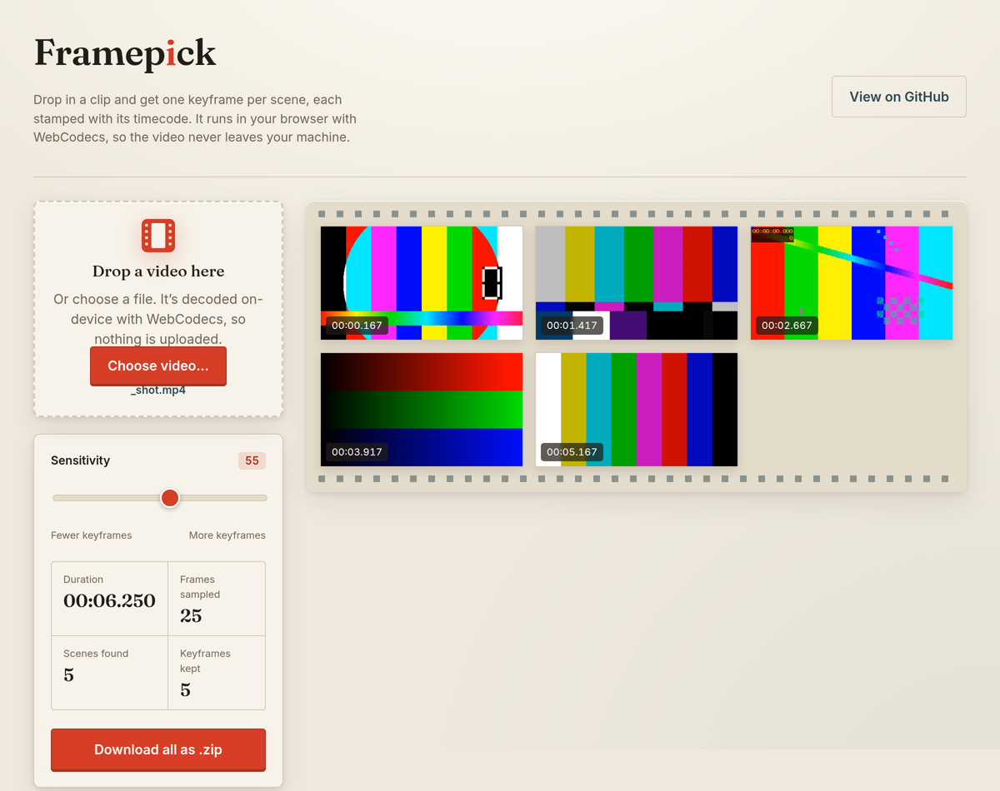

# Framepick

**▶ Live demo — [apps.charliekrug.com/framepick](https://apps.charliekrug.com/framepick/)**

[](https://github.com/ctkrug/framepick/actions/workflows/ci.yml)
[](LICENSE)

Pull the keyframes from any clip, no upload. Drop in a video and Framepick hands back one
keyframe per scene, each stamped with its timecode. It decodes the file in your browser with the
[WebCodecs API](https://developer.mozilla.org/en-US/docs/Web/API/WebCodecs_API), so the video
never leaves your machine.



## Who it's for

Editors, YouTubers, and video creators who need the representative frames from a clip fast: a
thumbnail candidate, a shot list, or a contact sheet. The usual routes are scrubbing the timeline
by hand, uploading footage to a web tool that ingests it to a server, or remembering the right
ffmpeg scene-filter flags. Framepick does it on the page, on-device, in a few seconds.

## What you get

- **One keyframe per scene, not per frame.** Framepick detects cuts and keeps a single
  establishing frame for each shot, then collapses near-duplicates so the contact sheet is shots,
  not noise.
- **Exact timecodes.** Every keyframe carries the timestamp it came from (`01:23.400`), ready to
  drop into a shot list or an edit note.
- **A sensitivity slider that responds instantly.** Slide toward "more keyframes" or "fewer" and
  the sheet re-segments from cached frames, with no second decode.
- **PNG and zip export.** Save any single frame, or download every keyframe at once as a zip.
- **Nothing uploaded.** The decode runs in a Web Worker on your machine. A 200 MB clip is
  analyzed without a byte crossing the network, so private or unreleased footage stays private.

## Run it locally

It's a static site with no build step to run it:

```bash
git clone https://github.com/ctkrug/framepick.git
cd framepick
python3 -m http.server 8000   # or any static file server
# open http://localhost:8000
```

WebCodecs support is required (Chrome or Edge 94+, and recent Safari). Framepick detects an
unsupported browser on load and says so instead of failing silently.

## How it works

The interesting decisions live in framework-free modules under `src/lib/`, unit-tested in Node:

1. **Demux and decode.** `src/decode.js` feeds encoded chunks from
   [mp4box.js](https://github.com/gpac/mp4box.js) (vendored, BSD-3) to a hardware-accelerated
   `VideoDecoder` and walks actual decoded frames, sampling about four per second.
2. **Signature.** Each sampled frame is reduced to an 8x8 grid of average brightness
   (`src/lib/signature.js`), a fingerprint that is cheap to compare and stays steady through
   grain and compression noise.
3. **Segment and dedup.** Where the frame-to-frame signature distance spikes, a cut is marked;
   one keyframe is picked per scene and near-identical shots are dropped (`src/lib/scenes.js`).
4. **Present.** The survivors render as a filmstrip contact sheet with per-frame and bulk export.

See [`docs/ARCHITECTURE.md`](docs/ARCHITECTURE.md) for the full data flow and
[`docs/VISION.md`](docs/VISION.md) for the rationale. The visual direction is in
[`docs/DESIGN.md`](docs/DESIGN.md).

## Tests

```bash
npm test
```

The pure-logic core (timecode, signatures, sampler, scene segmentation, sensitivity mapping,
stats invariant, and the ZIP writer) carries the automated correctness burden with `node --test`.
The browser layer (WebCodecs decode, workers, DOM) is verified end-to-end against a generated
multi-scene MP4 in headless Chromium.

## Build the deploy bundle

`node build.mjs` gathers the runtime files (`index.html`, `styles/`, `src/`, `vendor/`) into
`site/` for hosting. Every asset path is relative, so the bundle also works unchanged under a
sub-path such as `apps.charliekrug.com/framepick/`.

## License

[MIT](LICENSE) © Charlie Krug

More of Charlie's projects → [apps.charliekrug.com](https://apps.charliekrug.com)
